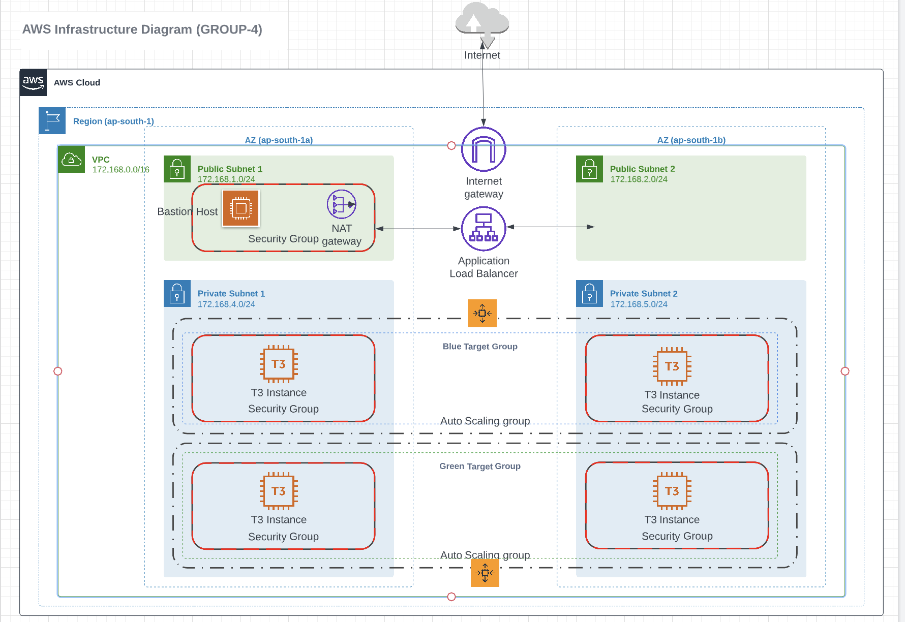

# blue-green-asg

# Infra Diagram

<!-- BEGIN_TF_DOCS -->
## Requirements

No requirements.

## Providers

| Name | Version |
|------|---------|
|  [aws](#provider\_aws) | 4.31.0 |

## Modules

No modules.

## Resources

| Name | Type |
|------|------|
| [aws_alb_listener.listener_http](https://registry.terraform.io/providers/hashicorp/aws/latest/docs/resources/alb_listener) | resource |
| [aws_alb_target_group.tg_blue](https://registry.terraform.io/providers/hashicorp/aws/latest/docs/resources/alb_target_group) | resource |
| [aws_alb_target_group.tg_green](https://registry.terraform.io/providers/hashicorp/aws/latest/docs/resources/alb_target_group) | resource |
| [aws_autoscaling_attachment.asg_attachment_blue](https://registry.terraform.io/providers/hashicorp/aws/latest/docs/resources/autoscaling_attachment) | resource |
| [aws_autoscaling_attachment.asg_attachment_green](https://registry.terraform.io/providers/hashicorp/aws/latest/docs/resources/autoscaling_attachment) | resource |
| [aws_autoscaling_group.asg_blue](https://registry.terraform.io/providers/hashicorp/aws/latest/docs/resources/autoscaling_group) | resource |
| [aws_autoscaling_group.asg_green](https://registry.terraform.io/providers/hashicorp/aws/latest/docs/resources/autoscaling_group) | resource |
| [aws_autoscaling_policy.asg_policy_blue](https://registry.terraform.io/providers/hashicorp/aws/latest/docs/resources/autoscaling_policy) | resource |
| [aws_autoscaling_policy.asg_policy_green](https://registry.terraform.io/providers/hashicorp/aws/latest/docs/resources/autoscaling_policy) | resource |
| [aws_instance.bastion_host](https://registry.terraform.io/providers/hashicorp/aws/latest/docs/resources/instance) | resource |
| [aws_launch_template.blue_template](https://registry.terraform.io/providers/hashicorp/aws/latest/docs/resources/launch_template) | resource |
| [aws_launch_template.green_template](https://registry.terraform.io/providers/hashicorp/aws/latest/docs/resources/launch_template) | resource |
| [aws_lb.bg_alb](https://registry.terraform.io/providers/hashicorp/aws/latest/docs/resources/lb) | resource |
| [aws_security_group.alb_sg](https://registry.terraform.io/providers/hashicorp/aws/latest/docs/resources/security_group) | resource |
| [aws_security_group.asg_sg](https://registry.terraform.io/providers/hashicorp/aws/latest/docs/resources/security_group) | resource |
| [aws_security_group.bastion_sg](https://registry.terraform.io/providers/hashicorp/aws/latest/docs/resources/security_group) | resource |
| [aws_ami.ami_apache_blue](https://registry.terraform.io/providers/hashicorp/aws/latest/docs/data-sources/ami) | data source |
| [aws_ami.ami_apache_green](https://registry.terraform.io/providers/hashicorp/aws/latest/docs/data-sources/ami) | data source |
| [aws_ami.ami_nginx_blue](https://registry.terraform.io/providers/hashicorp/aws/latest/docs/data-sources/ami) | data source |
| [aws_ami.ami_nginx_green](https://registry.terraform.io/providers/hashicorp/aws/latest/docs/data-sources/ami) | data source |
| [aws_ami.ubuntu](https://registry.terraform.io/providers/hashicorp/aws/latest/docs/data-sources/ami) | data source |
| [aws_subnet.private_1](https://registry.terraform.io/providers/hashicorp/aws/latest/docs/data-sources/subnet) | data source |
| [aws_subnet.private_2](https://registry.terraform.io/providers/hashicorp/aws/latest/docs/data-sources/subnet) | data source |
| [aws_subnet.public_1](https://registry.terraform.io/providers/hashicorp/aws/latest/docs/data-sources/subnet) | data source |
| [aws_subnet.public_2](https://registry.terraform.io/providers/hashicorp/aws/latest/docs/data-sources/subnet) | data source |
| [aws_vpc.bg_vpc](https://registry.terraform.io/providers/hashicorp/aws/latest/docs/data-sources/vpc) | data source |

## Inputs

| Name | Description | Type | Default | Required |
|------|-------------|------|---------|:--------:|
|  [ami\_apache\_blue](#input\_ami\_apache\_blue) | This is the ami name for Blue instance | `string` | n/a | yes |
|  [ami\_apache\_green](#input\_ami\_apache\_green) | This is the ami name for Green instance | `string` | n/a | yes |
|  [ami\_nginx\_blue](#input\_ami\_nginx\_blue) | This is the ami name for Blue instance | `string` | n/a | yes |
|  [ami\_nginx\_green](#input\_ami\_nginx\_green) | This is the ami name for Green instance | `string` | n/a | yes |
|  [owner\_id](#input\_owner\_id) | Contains the Owner Id of the AMI | `string` | n/a | yes |

## Outputs

No outputs.
<!-- END_TF_DOCS -->